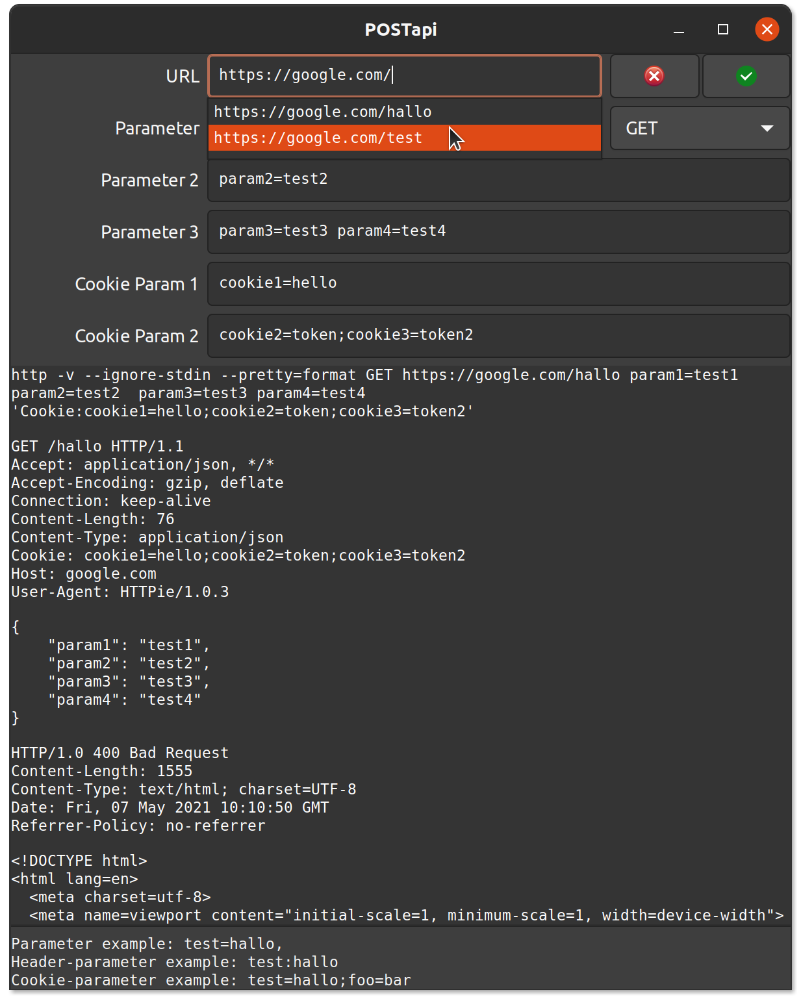

# POSTapi - a simple API testing tool

POSTapi is a simple tool for testing APIs written in Python. It is powered by [HTTPie](https://github.com/httpie/httpie).

## Features

* Sending GET, POST, PUT, PATCH, DELETE requests
* Requests with parameters
* and cookies
* It has a history function

History allows switching between urls without entering all params and cookies over and over again. They are connected to the url.



## Installation

First, HTTPie needs to be installed.
```bash
$ sudo apt install httpie
```

Next step cloning project
```bash
$ git clone github.com/randree/postapi
```
and finally

```bash
$ cd postapi
$ ./postapi.py
```


